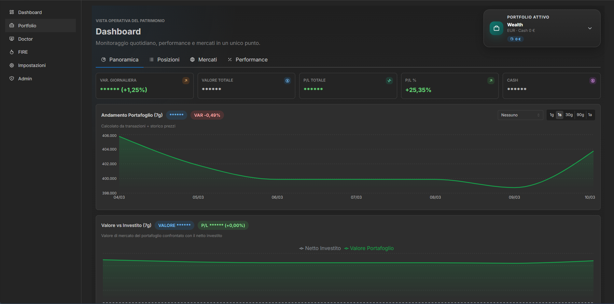
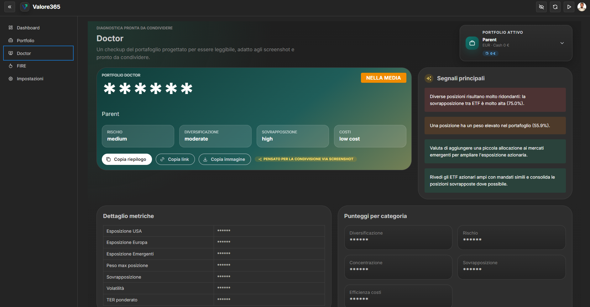
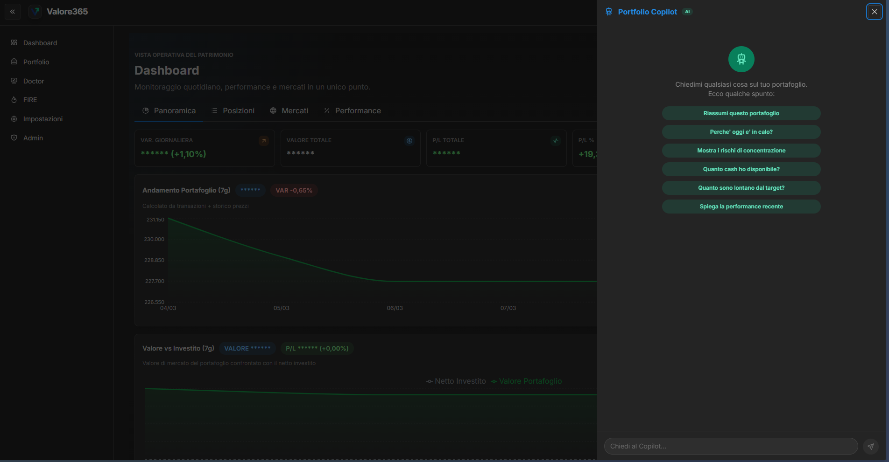

# 🚀 Valore365

## 🧠 Capisci se il tuo portafoglio è davvero ben costruito

Valore365 è una piattaforma di **portfolio intelligence** pensata per investitori italiani che vogliono **analizzare, comprendere e migliorare il proprio portafoglio**.

A differenza dei normali portfolio tracker, Valore365 si concentra sulla **struttura del portafoglio**:

- 🌍 diversificazione geografica  
- 📊 concentrazione degli asset  
- 🔁 sovrapposizione tra ETF  
- ⚠️ rischio complessivo  

---

# ⚡ Demo

Puoi provare l'analisi del portafoglio **senza registrazione**.
https://valore365.vercel.app/instant-analyzer

### 🧾 Input esempio

VWCE 10000
AGGH 5000
EIMI 2000

### 📊 Output

Portfolio Score: 74

⚠️ Esposizione USA elevata
⚠️ Sovrapposizione ETF
💡 Migliora la diversificazione

---

# 🩺 Portfolio Doctor

Il **Portfolio Doctor** analizza automaticamente il portafoglio e produce una diagnosi.

### 📋 Esempio

Portfolio Score: 74 / 100

📉 Rischio: medio
🌍 Diversificazione: buona
💰 Costi: bassi

⚠️ Avvisi

Esposizione USA elevata

Sovrapposizione ETF

L'analisi è **deterministica e basata su regole**, per garantire risultati coerenti.

---

# 🤖 Portfolio Copilot

Il **Portfolio Copilot** è un assistente AI che aiuta a interpretare la diagnosi del portafoglio.

Puoi chiedere:

Perché il mio score è 72?
Qual è il problema principale del mio portafoglio?
Come posso ridurre il rischio?
Come posso migliorare la diversificazione?

Il Copilot utilizza i dati del **Portfolio Doctor** per fornire spiegazioni chiare.

---

# 📊 Portfolio Tracking

Valore365 permette anche di monitorare il portafoglio nel tempo:

- 📈 performance
- 🧭 allocazione
- 📅 storico del valore
- 🎯 target allocation

---

# 🔁 ETF Overlap Detection

Molti portafogli contengono ETF che replicano **gli stessi titoli** senza che l’investitore se ne accorga.

Valore365 identifica automaticamente queste **sovrapposizioni**.

---

# ⚙️ Come funziona

Valore365 separa due livelli:

🩺 Portfolio Doctor
↓
analizza il portafoglio

🤖 Portfolio Copilot
↓
spiega i risultati

Questo approccio mantiene l’analisi **affidabile e verificabile**.

---

# 🖼 Screenshot

---

# 🏗 Architettura

### 💻 Frontend

- React
- Vite
- TypeScript

### 🧠 Backend

- FastAPI
- Python

### 🗄 Database

- PostgreSQL

### ☁️ Infrastructure

- Docker
- cloud deployment ready

---

# 📂 Struttura del progetto

database/
src/backend/
src/frontend/
scripts/

---

# ▶️ Avvio in locale

Clonare il repository

git clone https://github.com/ascatox/Valore365

cd Valore365

Avviare i servizi

docker compose up

Aprire nel browser

http://localhost:3000

---

# 🎯 Visione

Molti strumenti si limitano a **monitorare gli investimenti**.

Valore365 vuole aiutare gli investitori a **capire davvero il portafoglio**.

Domande a cui risponde:

- ❓ Il mio portafoglio è diversificato?
- ❓ Ho troppa esposizione a un mercato?
- ❓ I miei ETF si sovrappongono?
- ❓ Cosa dovrei migliorare?

---

# 🛣 Roadmap

Possibili sviluppi futuri:

- 🔮 simulazioni di portafoglio  
- 📊 analisi ETF più avanzata  
- 🤖 Copilot più evoluto  
- 🏦 supporto a nuovi broker  

---

# 🤝 Contribuire

Contributi e suggerimenti sono benvenuti.

Apri una **issue** o una **pull request**.

---

# 📜 Licenza

MIT License

---

⭐ Se il progetto ti interessa lascia una **stella al repository**